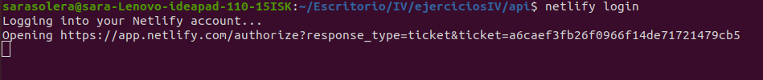

# Ejercicio 1. Darse de alta en Verce y Firebase, descargarse los SDKs para poder trabajar con ellos localmente.
Registrarse es muy fácil con nuestras cuentas de github, simplemente indicamos que nos queremos conectar a través de github y se sincroniza. Para descargalos simplemente ejecutamos:
- Para Vercel:
    - npm i -g Vercel
- Para Firebase
    - npm i -g firebase-tools
# Ejercicio 2. Tomar alguna de las funciones de prueba de vercel y hacer despliegues de prueba con el mismo.
En node tenemos el ejemplo .
Creamos el ejemplo en nuestro repositorio y hacemos push.

Tras hacer push, y vercel --prod en la página de Vercel seleccionamos nuestro ejercicio:

Clicamos en el primero, en la carpeta donde tengamos el fichero y añadimos en la barra el nombre y como resultado obtenemos:

Podemos [clicar aquí para verlo](https://ejercicios-iv-2xbw1kxwg.vercel.app/api/hello.js)

# Ejercicios 3. Tomar alguna de las funciones de prueba de Netlify, y hacer despliegues de prueba con el mismo.
Lo primero es darse de alta en netlify sincronizandolo con nuestra cuenta de github.
Despues debemos descargar netlify:
 - install netlify-cli -g
Tras ello debemos iniciar sesión para poder desplegar el ejemplo, 
Ejecutamos netlify login y nos pide permiso:

La página web no pide autorización:

Y lo autorizamos.

Y lo desplegamos:

En enlace lo tenemos [aqui](https://elastic-kare-effc61.netlify.app/.netlify/functions/hello).