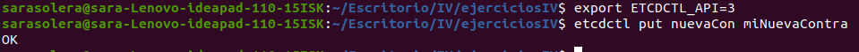
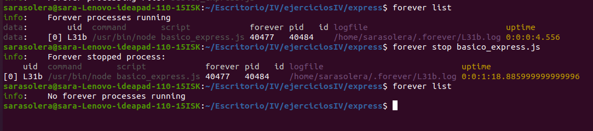

# Ejercicio 1. 
Lo primero es instalar etcd3

Si buscamos etcd3 con nodejs, la mayoría de ejemplos incorporan etcd3 mediante la biblioteca 'etcd3' por lo que, esa es la biblioteca aceptada por mi lenguaje.

Antes de realizar el programa que capte una contraseña, para que el cliente funcione bien podemos y esto nos va a permitir captar
la contraseña, para usar etcdtl consulte está [información](https://github.com/etcd-io/etcd/tree/master/etcdctl) y para saber que era necesario el [export](https://github.com/etcd-io/etcd/issues/6897):

Realizamos el programa, por el que captamos la contraseña mediante etcdctl, 

![]/img/funciona_etc.png)

# Ejercicio 2.

Hacer un ejemplo básico en express.
Primero guardamos la dependencia en package.json.

Comenzamos a realizar el programa:

Como es obvio necesitamos utilizar express, una vez instalada la dependencia, hacemos el require correspondiente y creamos el objeto, y el puerto por donde vamos a escuchar las peticiones.

Para el inicio la ruta convencional o mas utilizada es /

Ejecutamosy y ya estará esperando peticiones:

Podemos añadir funciones según diferentes rutas, por ejemplo para saber el día actual:

Ver el año:

Indicar el puerto en una variable de entorno es un buena practica, ya que cada despliegue necesitará un puerto determinado.

# Ejercicio 3.
Ya he incluido la variable port en el ejercicio anterior, así como la variable que he creado para acceder a la fecha actual.

# Ejercicio 4. Crear pruebas para las diferentes rutas de la aplicación
Vamos a realizar el testeo de las rutas que hayamos creado. EN los apuntes vemos que podemos incluir los test simplemente mediante librerias de assercion, en node debemos como siempre incluir la dependencia y ya podremos usarlo.

Si buscamos la biblioteca [supertest](https://www.npmjs.com/package/supertest) podemos encontrar formas de testear nuestras funciones

# Ejercicio 5.

Los gesores de procesos mas usados con node son
 - StringLoop Process Manager
 - PM2
 - [Forever](https://expressjs.com/es/advanced/pm.html#forever)
Ya que en los apuntes de clase vi la utilidad de PM2 voy a probar forever, es bueno para despliegues peuqeños, y garantiza la ejecucion continua de un determinado script

1. Instalar
    - npm install forever -g 
2. Para iniciar el script usamos el comando start, 
    - forever start index.js
Se recomienda reistrar la salida de la herramienta forever, utilizando las opciones de registo de la siguiente maner:
 - forever start -l forever.log -o out.log -e err.log script.js
4. Para ver la lista de los script que hemos iniciado:
    - forever list
5. Por ultimo para pararlos ejecutamos:
    - forever stop [num_proceso]
    - forever stopall --> si queremos parar todos

Forever permite tener UN script en ejecución continua. Por lo que si necesitamos varios usuarios, la opcion mas acertada sera PM2. Ejemplo de ejecucion continua

Una vez terminemos solo debemos ejecutar stop, usando el num_proceso o el nombre del script.

# Ejercicio 6.
En mi caso en mi proyeto mi gestor de tareas es grunt, por lo que voy a trabajar con él.
Para el caso de grunt, tenemos un [plugin](https://www.npmjs.com/package/grunt-forever/v/0.4.5) que junta grunt y forever.
Para su instalacion hacemos:
    - npm install grunt-forever

Añadimos el plugin:

Añadimos la sección forever, en ella indicamos el path del fichero, y con el plugin podemos hacer start y stop

