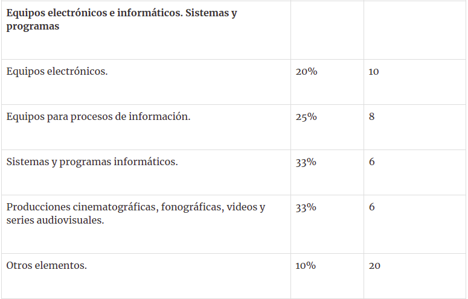
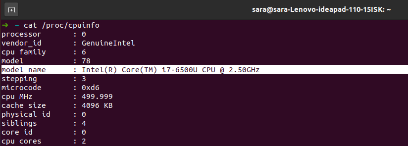
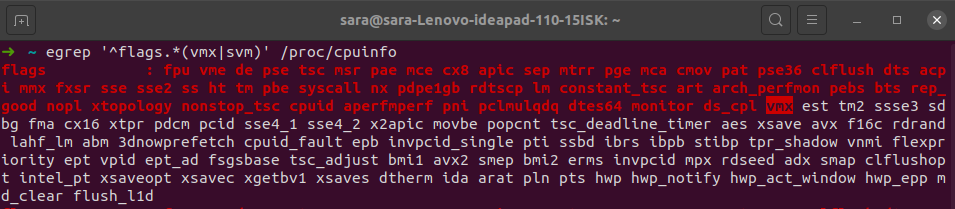
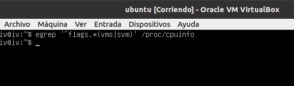
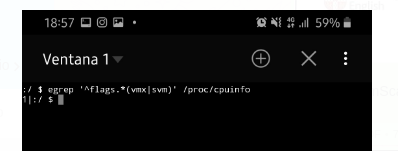

## Ejercicios de autoevaluación - TEMA 1

### Ejericio 1. Consultar en el catálogo de alguna tieneda de informática el precio de un ordenador tipo servidor y calcular su coste de amortización a cuatro y siete años. [Consultar este articulo en Infoautónomos sobre el tema](https://www.infoautonomos.com/consultas-a-la-comunidad/988/)

Estoy consultando la página [infoautonomos](https://www.infoautonomos.com/contabilidad/tablas-de-amortizacion-para-los-bienes-de-una-empresa/)

La tabla viene acotada en cuantos años máximos en los que se puede amortizar un bien, y el %máximo que podemos aplicar a la hora de amortizar un bien.

En nuestro caso tenemos:
 - Coeficiente lineal máximo (%) = 25
 - Periodo máximo (años) = 8

**Calculando limites**

Sabemos que el periodo máximo de amortización son 8 años, para ello el porcentaje mínimo en que puede amortizar es 100/8 = 12.5%
Nos movemos entre 12.5% y 25% para el porcentaje de amortización.

En años sabemos que el máximo es 8, y para el máximo porcentaje de amortización que es 25% tenemos 100/25 = 4 años.

Buscando ordenadores tipo servidor he encontrado un Dell PowerEdge por un precio de 2042.48€

Para 4 años, tenemos que el máximo es 25% luego
 - 2042.48 * 0.25 = 510.62€ anuales

 Si queremos amortizarlo en 7 años, tendríamos un porcentaje de 100/7 = 14.28%
 - 2042.48 * 0.148 = 291.78€ anuales

 ### Ejercicio 2. Usando las tablas de precios de servicios de alojamiento en Internet “clásicos”, es decir, que ofrezcan Virtual Private Servers o servidores físicos, y de proveedores de servicios en la nube, comparar el coste durante un año de un ordenador con un procesador estándar (escogerlo de forma que sea el mismo tipo de procesador en los dos vendedores) y con el resto de las características similares (tamaño de disco duro equivalente a transferencia de disco duro) en el caso de que la infraestructura comprada se usa solo el 1% o el 10% del tiempo.

Seleccionando las características:
 - 30 GB de SSD
 - 3GB de RAM
 - 2 vCPU

Servidor Cloud --> [arsys](https://www.arsys.es/servidores/cloud?s=cpc&c=315965763&a=19240941603&gclid=EAIaIQobChMI_pvC-KCT7AIVl_dRCh2cPQanEAAYASAAEgIW9PD_BwE)        
Precio: 39.50€ al mes , 30 dias Gratis

VPS -->  [ProfesionalHosting](https://www.profesionalhosting.com/servidores-virtuales-ssd/)
Precio: 18.99 al mes, si se contrata un año

Luego el precio de VPS se mantendría y nos costaría un total de 18.99 * 12 = 227.88€ da igual el tiempo que lo usemos.

En el caso del Servidor Cloud el precio es 39.50 al mes.
Tiene un precio de 0.05 € / hora
1% son 87.6 horas lo que da un precio de 4.38
10% son 876 horas lo que da un precio de 43.8

Por lo tanto económicamente nos sale más rentable arsys, aunque en el momento que le demos un uso mayor al 52% nos saldría más rentable contratar el VPS Profesional hosting. 

### Ejercicio 3. En general, cualquier ordenador con menos de 5 o 6 años tendrá estos flags. ¿Qué modelo de procesador es? ¿Qué aparece como salida de esa orden? Si usas una máquina virtual, ¿qué resultado da? ¿Y en una Raspberry Pi o, si tienes acceso, el procesador del móvil?
Para saber si mi portatil tiene actividad las capacidades de virtualización los apuntes nos ofrecen el comando:

egrep '^flags.*(vms|svm)'/proc/cpuinfo

 - cpuinfo contiene las caracteristicas de la CPU
 - vmx es el flag que se usa para indicar que el procesador usa esta tecnologia.
Si no lista nada, entonces el procesador no tiene la funcionalidad o la tiene desactivada.

Primero voy a ver el modelo de procesador que tengo:

**Modelo de procesador** 

Si buscamos ejecutamos el comando obtengo:

Como vemos mi ordenador si tiene la capacidad de virtualización por hardware.

En la máquina virtual con  linux 18.04:

Si ejecuto el comando en mi telefono:

No lo tiene o no lo tiene activado.

### Ejercicio 4. Instalar un hipervisor para gestionar máquinas virtuales, más adelante se podrá usar en pruebas y ejercicios. Usar siempre que sea posible un hipervisor que sea software libre.
Yo ya tengo instalado virtualBox que es donde hemos hecho prácticas de otras asignaturas, ademas donde he creado la máquina para el ejercicio 3.
Si buscamos un poco de información sobre hipervisores, vemos que VirtualBox es un hipervisor del tipo 2 es decir que se instala en el sistema operativo como otro software.

### Ejercicio 5. Darse de alta en una web que permita hacer pruebas con alguno de los sistemas de gestión de nube libres como los mencionados, aunque sea temporalmente. Si la prueba es menos de un mes, simplemente anotalo y dejarlo para el mes de diciembre.

En mi caso utilizaré Amazon Web Services que permite una prueba gratuita de 12 meses.

## Sara Solera Linares