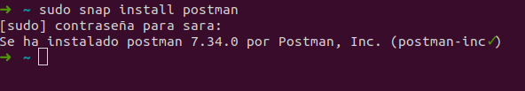
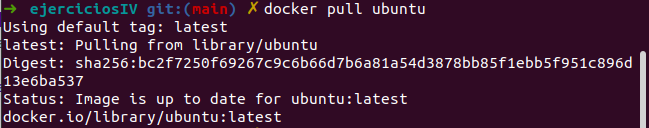
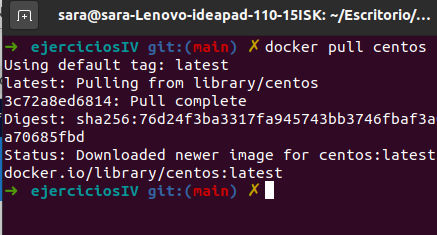
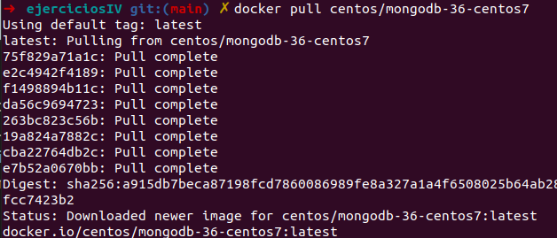

# Ejercicios tema 3 Sara Solera
## Ejercicio 1.Instalar docker y/o otro gestor de conteneodres como Podmn/Buildah
En mi caso, debido a otra asignatura ya tenia instalado docker, voy a instalar Podman.

## Ejercicio 2. 
    1.Instalar a partir de docker una imagen alternativa de Ubuntu y alguna adicional, por ejemplo de CentOS.

