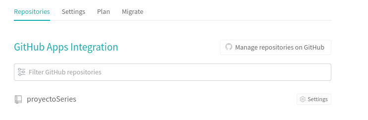
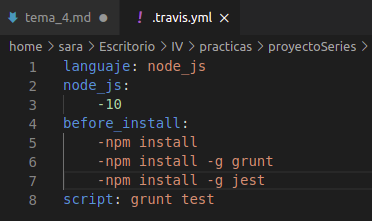

## Ejercicio 9. Haced los dos primeros pasos antes de pasar al tercero.
Los 2 primeros pasos:

    1. Darse de alta. Muchos están conectados con GitHub por lo que puedes autentificarte directamente desde ahí. A través de un proceso de autorización, puedes acceder al contenido e incluso informar del resultado de los tests a GitHub.
    2. Activar el repositorio en el que se vaya a aplicar la integración continua. Travis permite hacerlo directamente desde tu configuración; en otros se dan de alta desde la web de GitHub.

Yo en concreto ya estuve mirando travis y ya estoy dada de alta, cuando cliqué en la página ya tenia mi github guardado por lo que solo fue indicar darse de alta.

Travis nos da lo mismos pasos que en los apuntes, pero un poco más especifico

Activo repositorio de github

## Ejercicio 10.Configurar integración continua para nuestra aplicación usando Travis o algún otro sitio.
Tras darnos de alta en travis, y enlazar nuestro repositorio, podemos añadir nuestro fichero de configuración.
 - Los ficheros de configuración corresponden a una configurción de una máquin virtul que hiciera solo y exclusivamente la ejecución de los tests. Para ello indicamos en el fichero de configuración en mi caso, node, jest, y grunt.
En mi caso quedaría algo así:

Primero indicamos el lenguaje, travis tiene bastantes y los podemos encontrar en la [página oficial](https://docs.travis-ci.com/user/tutorial/). Tras el lenguaje indicamos la versión, en mi caso uso NodeJS versión 10, aunque podemos probar más de una.
 Indicamos en before_install la instalación de aplicaciones que necesitamos, y finalmente el script de prueba.

Esta configuración nos permite ser conscientes de todo lo necesario para desplegar nuestra aplcacuón, y por tanto es una forma alternativa de describir la infraestrctura virtual. Segundo, porque al crear los test comprobamos la calidad en el desarollo. Finalmente porque la interacion y los tests son un paso esencial para el desarollo continuo.
